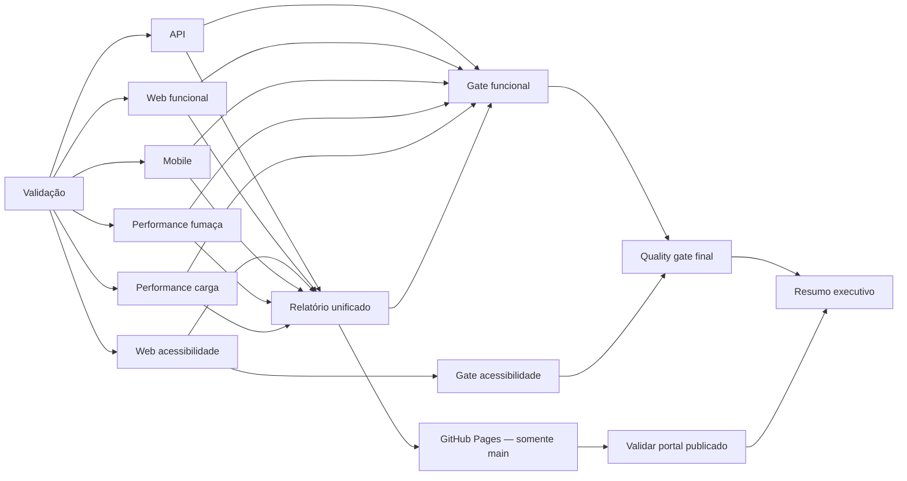

# Pipeline e Relatorio Unificado

## Jobs

`qualidade.yml` executa a validação inicial e, depois dela, API, Web funcional, Web acessibilidade, Mobile, k6 de fumaça e k6 de carga em paralelo. `web-funcional` executa typecheck, lint e somente os sete cenários funcionais; `web-acessibilidade` executa separadamente os quatro cenários `@acessibilidade` e mantém o bloqueio para impactos `serious` e `critical`.

O relatório unificado executa com `if: always()`, recebe os dois conjuntos Web e os consolida no módulo `Web E2E` com labels de origem `Funcional` e `Acessibilidade`. A decisão é dividida em `gate-funcional`, `gate-acessibilidade` e `quality-gate-final`. Assim, o log e o resumo da execução distinguem qualidade funcional aprovada de acessibilidade bloqueada, sem transformar o resultado final em sucesso artificial.



`carga-performance.yml` oferece uma execucao manual adicional apenas do perfil de 500 VUs. O mesmo perfil tambem participa de push, pull request e execucao manual do workflow `qualidade.yml`.

## Allure

O projeto `relatorio-unificado` usa Allure Report `3.14.2`, fixado no `package-lock.json`. Os scripts copiam os resultados para uma area temporaria, acrescentam labels de modulo e mantem os arquivos de origem inalterados. O k6 e representado por somente dois casos: Fumaca e Carga de 500 usuarios, cada um com os tres summaries anexados.

Para gerar localmente a partir de evidencias existentes:

```powershell
.\scripts\gerar-relatorio-unificado.ps1
```

```sh
bash ./scripts/gerar-relatorio-unificado.sh
```

O HTML autocontido fica em `relatorio-unificado/saida/index.html` e nao e versionado.

## Evidencias

Os resultados Allure obrigatórios usam os artifacts `resultados-api`, `resultados-web-funcional`, `resultados-web-acessibilidade` e `resultados-mobile`. Os perfis k6 usam `resultados-performance` e `resultados-performance-carga`. A ausência desses arquivos ou do consolidado `relatorio-allure-unificado` reprova o job; screenshots, vídeos, logs e relatórios auxiliares ficam em artifacts `evidencias-*` opcionais.

## Pages

Em pushes para `main`, o job **Publicar relatório no GitHub Pages** publica o artifact quando `relatorio-unificado` conclui com sucesso. A publicação independe dos gates: um portal bloqueado continua sendo evidência válida. Depois do deploy, `validar-portal-publicado` confere HTTP 200, status, links, metadados e coerência do `portal.json` público com o artifact. Em pull requests, Pages e a validação pós-deploy são ignorados corretamente.

`resumo-da-execucao` roda sempre e registra no `GITHUB_STEP_SUMMARY` os módulos, gates, decisão final, URL pública quando aplicável e link da execução com seus artifacts.
